# Genesis 2X Controller to USB Adapter

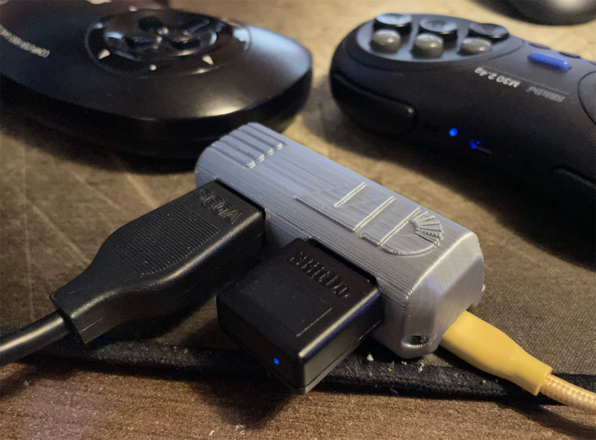
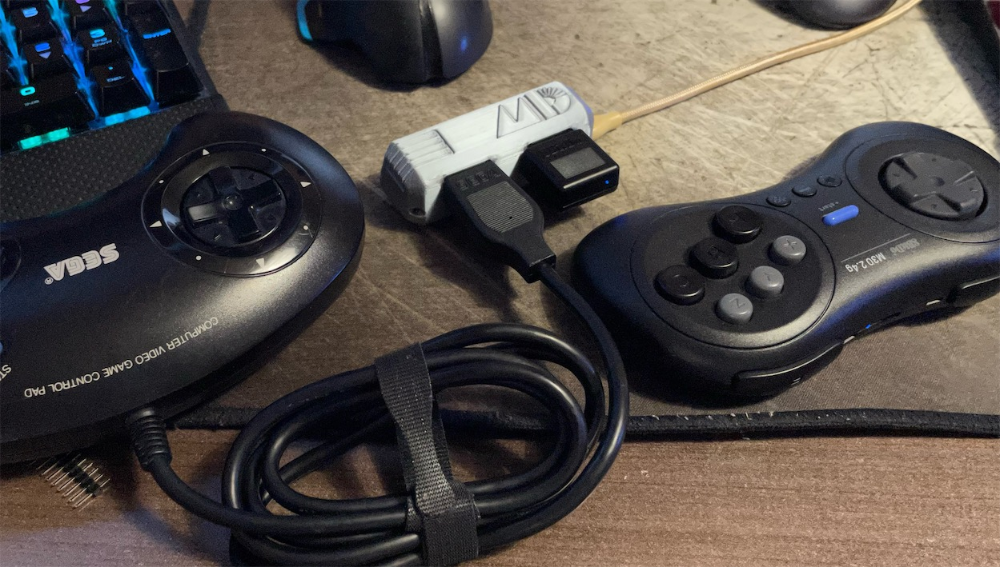

This is my take on the Genesis 2X Controller to USB Adapter, powered by [DaemonBite](https://github.com/MickGyver/DaemonBite-Retro-Controllers-USB).

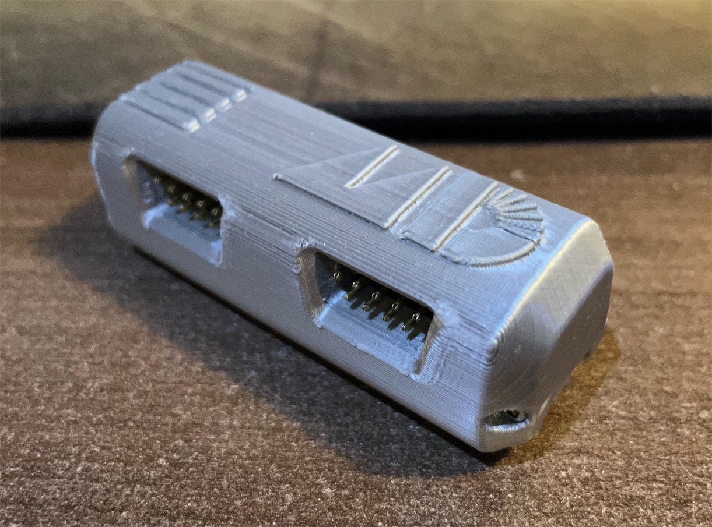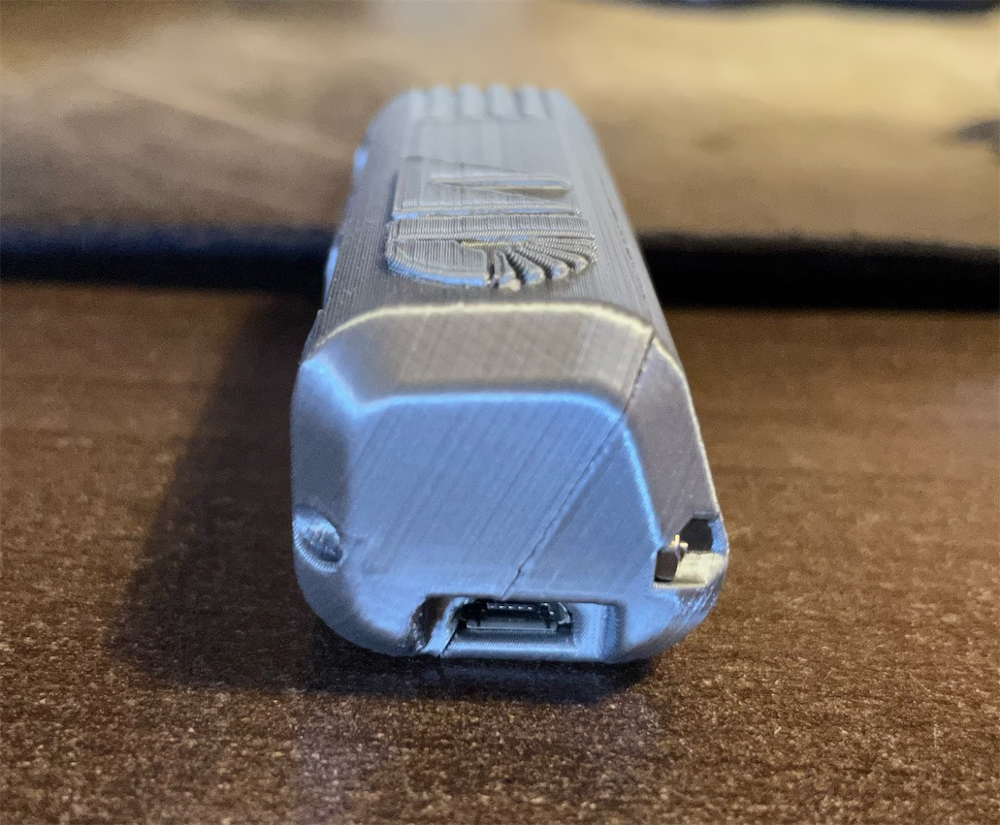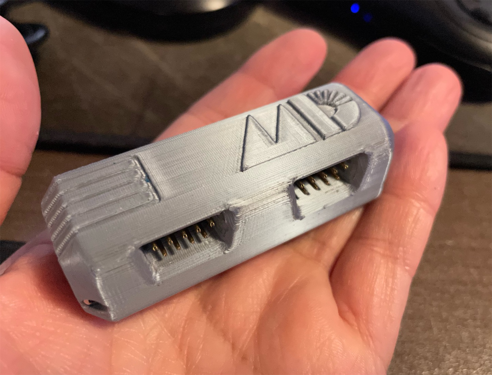

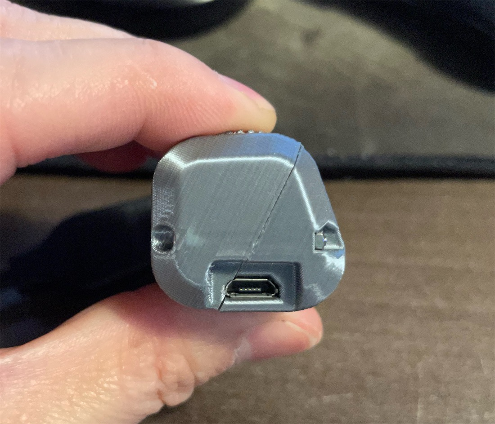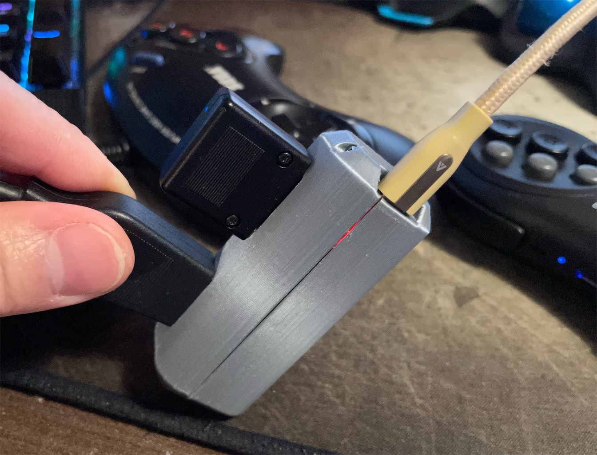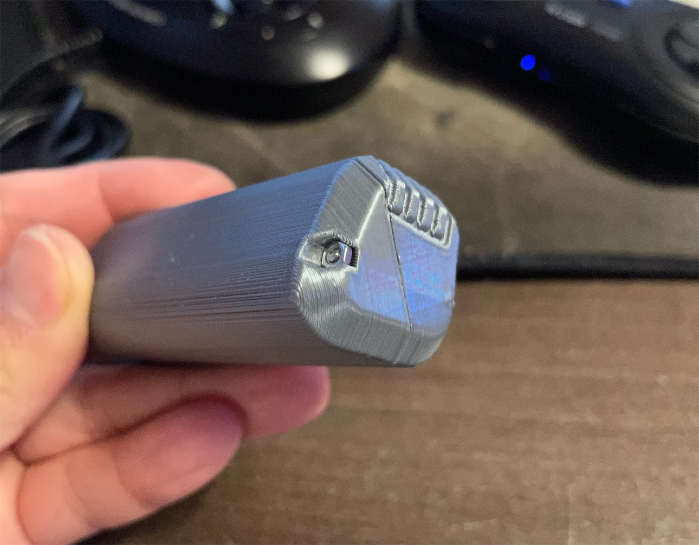

----------

## Parts

DB9 Ports
- https://www.aliexpress.com/item/4000028938823.html (Choose the DR9, Male option)

Arduino Pro Micro 5V/16MHz Version (basically search "pro micro 5v 16mhz" in Amazon)
- https://www.amazon.com/dp/B08THVMQ46
- https://www.amazon.com/dp/B01B26MAR6

PCB
- https://oshpark.com/shared_projects/lUJ4HBFS

[2x] M2x20mm Hex Screw & Nut
- https://www.amazon.com/gp/product/B014OO5KQG

[2x] 2.54mm Pitch Pin Header, Square Pins, Single Row - 12 pins on each side (Search on Amazon)

3D Printed Shell

---------

## 3D Printing

Print the two halves of the shell in their original orientation.

Suggested settings:
- 0.16 layer height
- 0.35 line width
- With support

-----------

## Assembly

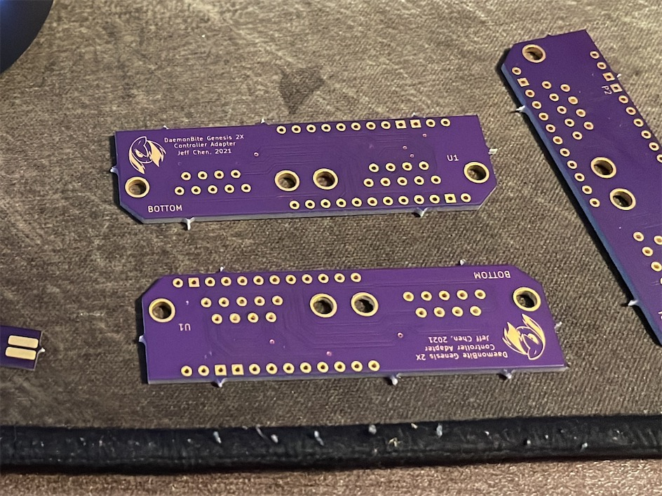

Trim all the extra stubs from the PCB.

Loosen the screws on both sides of the DB9 ports, but don't remove them yet.

Solder in the DB9 ports first. Then the Pro Micro on the other side with the pin headers. Trim the protruding pin header pins on the other side of the PCB. Otherwise you won't be able to fit the assembly into the shell.

Remove the screws and the face plate from the DB9 port. Otherwise you won't be able to fit the assembly into the shell.

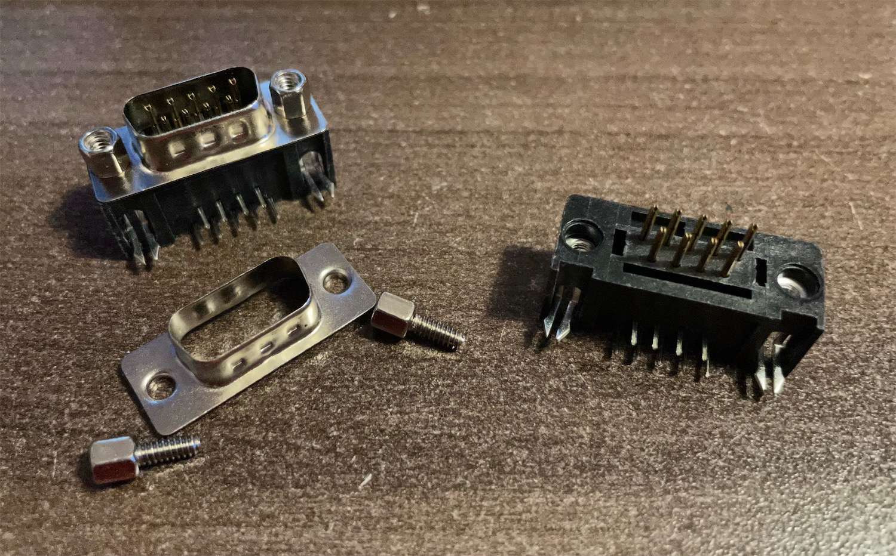
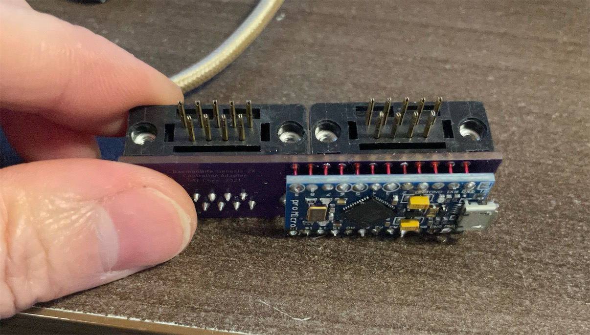

Finally, slide the assembly into the printed shell, and screw it shut with two sets of M2x20mm hex screws and nuts.
